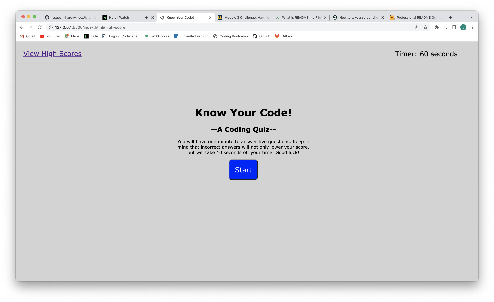
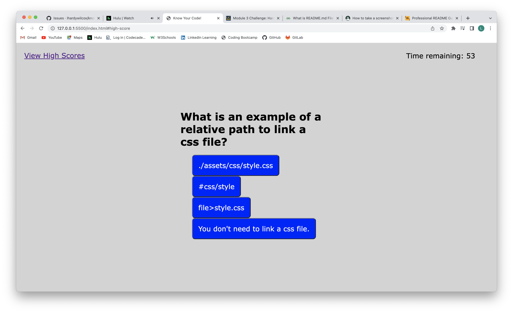
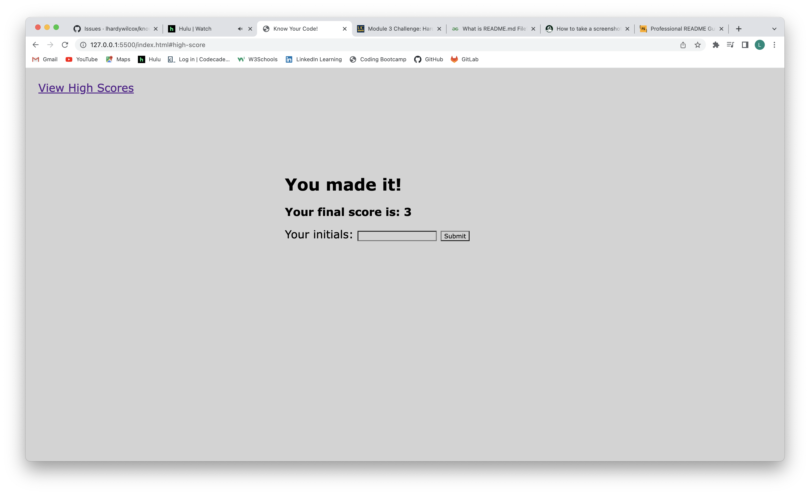
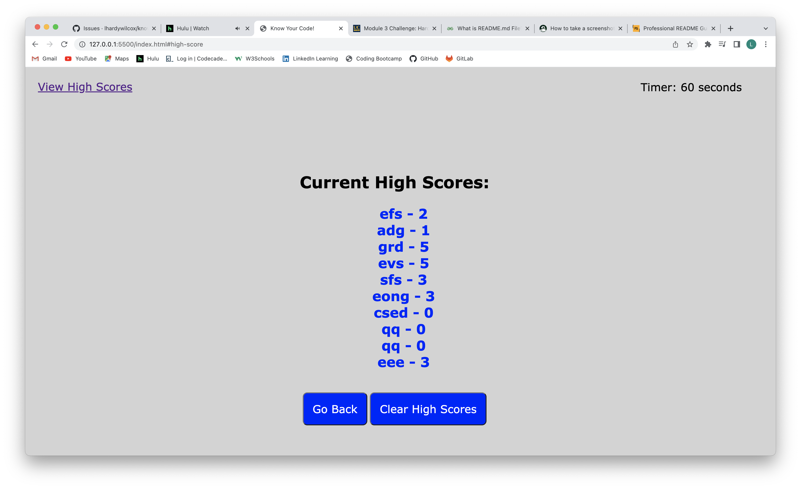

# know-your-code-quiz
A coding quiz project for bootcamp.

## Description
This quiz project is the first project that I built entirely from nothing.  This is something I could see being useful in my current career to help me evaluate some of my students.  It solves the problem of being able to administer a quiz, and have it automatically scored.

This project taught me how to organize my process a little more, by looking at the mock-ups, and asking questions about what each screen would need to be executed properly.  From there I was able to build the HTML skeleton, followed by some CSS styling.

The biggest challenge for me was to program the interactivity in Javascript.  I spent a lot of time thinking through the logic, and thinking about ways I could use Javascript to present the questions, instead of using a lot of repetitive HTML.  Putting the question objects into Javascript would also allow the question bank to be expanded more easily, and also allow additional programming to randomize the questions.

The programming of the timer, and getting it to take 10 seconds off for an incorrect answer was a challenge.

I also learned how to work with local storage, and a touch of JSON, to enable scores to be stored.  I also learned how to change the array of score objects into a string, and turn those into HTML elements to be inserted into my index.HTML code.

I also learned how to properly embed images into my README, thanks to some Feedback from my last assignment.

This project definitely shows some growth in my work, and I am proud to have persevered through the struggles with it. I truly learned a lot, and have gained motivation to keep learning.

## Usage
From the opening screen, simply press the start button to start the quiz (and the timer).  Once the questions have been answered, you will be given an opportunity to enter your initials to save your scores.  The View High Scores link will show you the list of scores saved in local storage (unless you are the first user in your browser to take the quiz).

## Credits
I received some help from a couple Learning Assistants and a couple tutors for this project, as well as some thoughts from one of our Teaching Assistants.  They were able to help me think through some important choices in the code, and walk me through some of the execution as well.

Some of the question content for this quiz was derived from some online quizzes at https://codeconquest.com.

A resource I used for displaying the high score list was:
"Build a Quiz App (9) - Load and Display High Scores from Local Storage" YouTube. James Q Quick, Feb 16, 2019.

## License
MIT License
